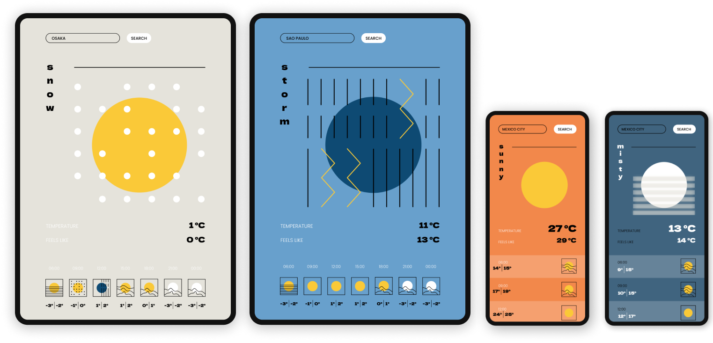

# GEO

GEO is a stylish weather app that uses live API data to display the weather anywhere, with the option to animate the illustrations using Lottie JS.

The aims of this project are:

- To practise using a JS framework - you can choose which one!
- To capture user input and use it to make custom API requests
- To practise fetching live data in an efficient way and passing the response down to the components that need it
- To render elements conditionally and change the UI depending on the data received
- To work with professional design files in Figma, with designs in 3 sizes and a style guide to help you set up your project
- To make it fully responsive and write organised, re-usable CSS
- Continue getting comfortable working with Git and making Pull Requests
- Bonus: Practice working in an Agile way by creating your own Kanban board of tasks, estimating your tickets and planning your sprints

[Get the project here](https://codecaravan.io/projects/geo?source=ghbaserepo): receive the designs, styleguide, task list and join weekly mentoring sessions with a senior developer to help you make better progress.

## How to get your code reviewed

You can get your code reviewed by a CodeCaravan mentor and experienced developer. This will be done by opening a Pull Request on Github, which your reviewer will comment on.

In order for this to be possible, you'll need to follow a few simple steps:

Before you start working on this project, make sure you **fork this repository first**

This will ensure your personal version of GEO is connected to CodeCaravan's - making it possible to open Pull Requests pointing to CodeCaravan on Github, which will enable CodeCaravan mentors to review your code if you request it.

**Follow these steps:**

- **Fork this repo:** this will create a copy of it on your own Github account
- **Then clone** this new personal version of the repo (you should now be on github.com/yourgithubusername/GEO, where 'yourgithubusername' is your Github username). This is where you will write your code.
- **Start working** and committing code. If you're creating an app with a JS framework like React, you should create it inside this new repo (navigate to the root folder with the command line, and create your app from there)
- Once you have your app set up, test that it works and that changes you make are showing. Make one simple change at first: Add 1-2 lines of code, commit and push, and then check that github.com/yourgithubusername/GEO reflects the change
- When you're ready to submit some work for feedback, **open a Pull Request** from your repo pointing to CodeCaravan's original version.

If you have any trouble or questions, feel free to ask in the [#code-reviews channel on Discord](https://discord.gg/BdeBF5vz).
